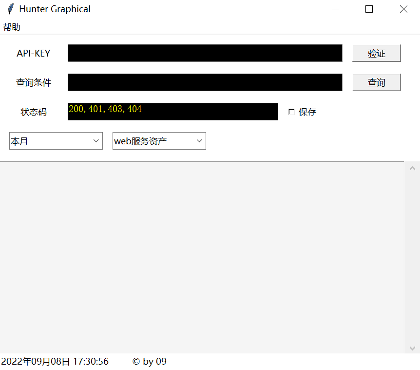
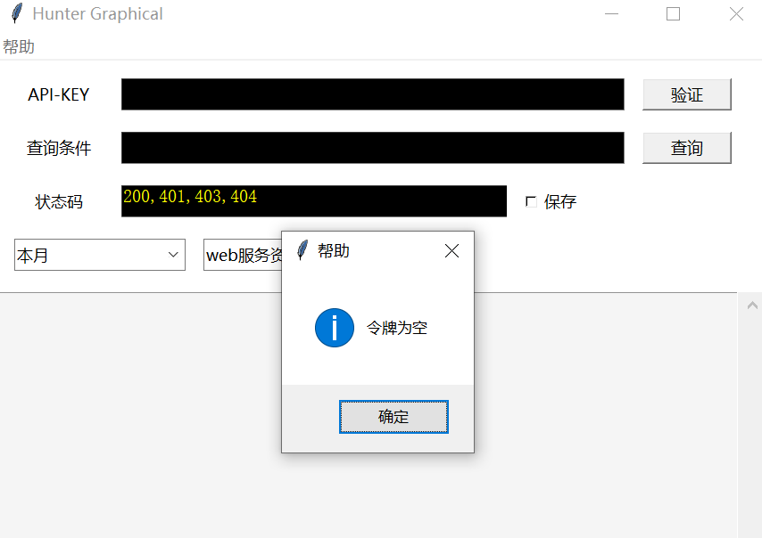
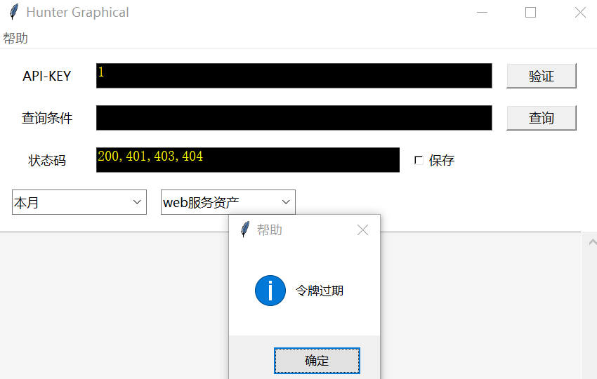
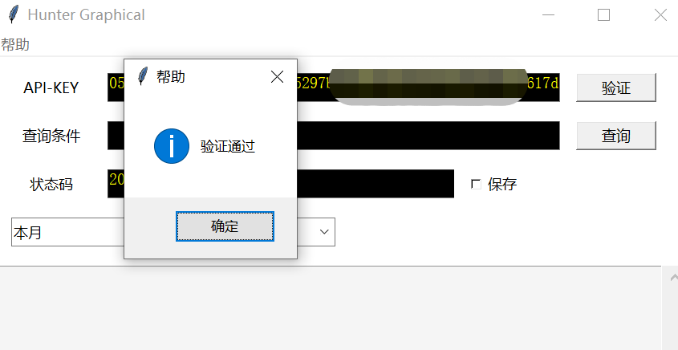
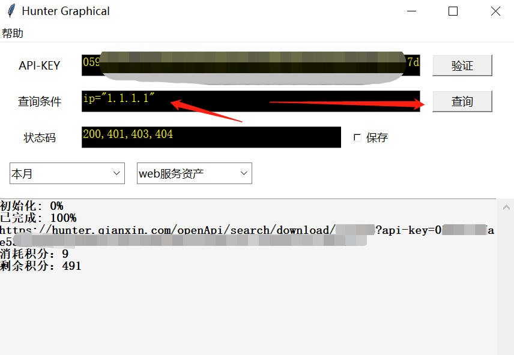
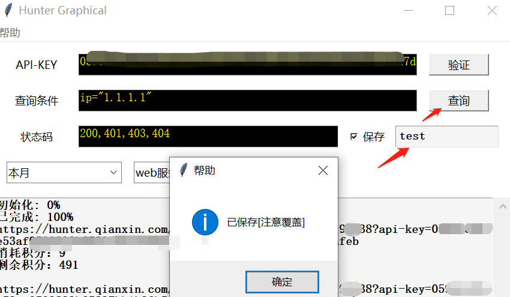
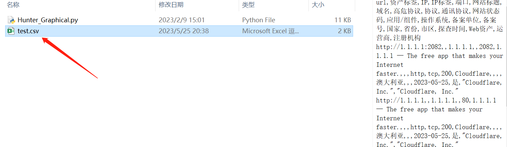

# Hunter_Graphical
奇安信网络空间测绘引擎 Hunter 图形化 api 查询导出工具

**[Usage]**
command: python3 Hunter_Graphical.py

1、首先，输入正确的令牌：错误的令牌会给出提示  
  

2、输入查询语法后点击查询，如：ip="1.1.1.1"  

3、保存到当前目录下的指定文件中，如：test.csv  
  

